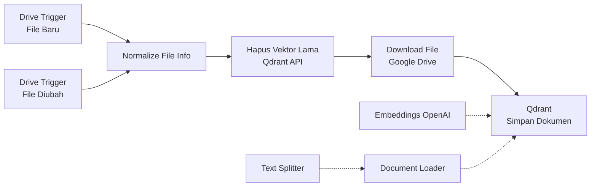
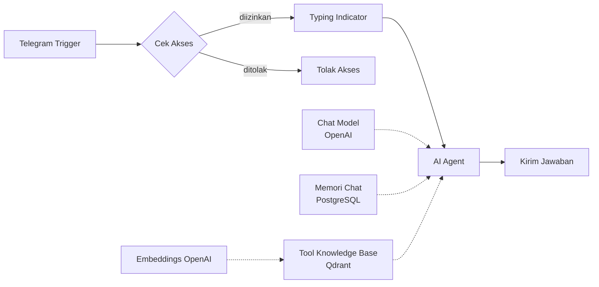

# RAG Knowledge Base Chatbot

Chatbot Telegram yang menjawab pertanyaan berdasarkan dokumen di Google Drive menggunakan **Retrieval-Augmented Generation (RAG)**. Dokumen yang ditambahkan atau diubah di Drive diproses otomatis ke vector database (Qdrant), lalu AI Agent mencari informasi yang relevan di dalamnya dan menjawab lengkap dengan sitasi nama file sumber.

Seluruh sistem dibangun sebagai satu workflow **n8n** tanpa backend kustom.

---

## Daftar Isi

- [Fitur Utama](#fitur-utama)
- [Arsitektur](#arsitektur)
- [Teknologi yang Digunakan](#teknologi-yang-digunakan)
- [Struktur Repository](#struktur-repository)
- [Prasyarat](#prasyarat)
- [Instalasi](#instalasi)
- [Konfigurasi Workflow](#konfigurasi-workflow)
- [Cara Penggunaan](#cara-penggunaan)
- [Penjelasan Detail Workflow](#penjelasan-detail-workflow)
- [Keamanan](#keamanan)
- [Troubleshooting](#troubleshooting)
- [Keterbatasan](#keterbatasan)
- [Rencana Pengembangan](#rencana-pengembangan)
- [Lisensi](#lisensi)

---

## Fitur Utama

| Fitur | Keterangan |
|---|---|
| **Sinkronisasi otomatis** | File baru atau yang diubah di folder Google Drive otomatis di-embed ulang. Vektor lama dihapus lebih dulu agar tidak ada data ganda. |
| **Tanya jawab berbasis dokumen** | AI Agent memanggil tool pencarian vektor dan menjawab hanya dari isi dokumen yang ditemukan. |
| **Sitasi sumber** | Setiap jawaban faktual ditutup dengan baris `Sumber: nama_file` yang diambil dari metadata dokumen. |
| **Memori percakapan** | Riwayat 10 pesan terakhir per chat disimpan di PostgreSQL, sehingga pertanyaan lanjutan tetap nyambung. |
| **Kontrol akses** | Hanya chat ID yang terdaftar yang bisa memakai bot. Pesan non-teks dan pengguna tidak dikenal ditolak. |
| **Indikator mengetik** | Bot mengirim status "typing" selama Agent memproses jawaban. |
| **Multi-format dokumen** | Mendukung PDF, teks, serta Google Docs dan Sheets (dikonversi ke PDF saat diunduh). |

---

## Arsitektur

Workflow terdiri dari dua alur independen dalam satu canvas n8n.

### Alur 1: Ingestion (Google Drive ke Qdrant)



### Alur 2: Chatbot (Telegram ke AI Agent)



Garis putus-putus menunjukkan koneksi sub-node (model, memori, tool, embeddings) ke node induknya.

### Alur data singkat

1. Anda mengunggah atau mengubah dokumen di folder Drive.
2. Drive Trigger mendeteksinya (polling setiap menit).
3. Vektor lama milik file itu dihapus dari Qdrant berdasarkan `metadata.file_id`.
4. File diunduh, dipecah menjadi potongan teks, diubah menjadi embedding, lalu disimpan ke Qdrant bersama metadata `file_id` dan `file_name`.
5. Pengguna mengirim pertanyaan lewat Telegram.
6. AI Agent memanggil tool Knowledge Base, yang mengubah pertanyaan menjadi embedding dan mengambil 5 potongan paling relevan.
7. LLM menyusun jawaban dari potongan tersebut dan menambahkan sitasi sumber.
8. Jawaban dikirim kembali ke Telegram.

---

## Teknologi yang Digunakan

| Komponen | Fungsi |
|---|---|
| [n8n](https://n8n.io) | Orkestrasi workflow dan AI Agent |
| [Qdrant](https://qdrant.tech) | Vector database |
| OpenAI `text-embedding-3-small` | Model embedding (1536 dimensi) |
| OpenAI `gpt-4o-mini` | Model bahasa untuk AI Agent |
| PostgreSQL | Penyimpanan memori percakapan (dan database n8n) |
| Google Drive API | Sumber dokumen |
| Telegram Bot API | Antarmuka chat |
| Docker Compose | Deployment self-hosted |

Model dapat diganti lewat node **Chat Model** dan **Embeddings**. Jika Anda mengganti model embedding, dimensi vektor bisa berbeda, sehingga koleksi Qdrant harus dibuat ulang dan seluruh dokumen di-embed ulang.

---

## Struktur Repository

```
.
├── README.md
└── workflows/
    └── rag_knowledge_base_chatbot.json   # workflow n8n siap import
```

Contoh `docker-compose.yml` ada di bagian [Instalasi](#instalasi).

---

## Prasyarat

- Docker dan Docker Compose (atau instance n8n yang sudah berjalan)
- Akun Google dengan akses ke Google Cloud Console (untuk OAuth Google Drive)
- Akun Telegram untuk membuat bot lewat [@BotFather](https://t.me/BotFather)
- API key OpenAI
- Domain atau tunnel **HTTPS publik** yang mengarah ke n8n (syarat webhook Telegram)

---

## Instalasi

### 1. Siapkan infrastruktur dengan Docker Compose

Buat `docker-compose.yml`:

```yaml
services:
  postgres:
    image: postgres:16
    restart: unless-stopped
    environment:
      POSTGRES_USER: n8n
      POSTGRES_PASSWORD: ganti_password_kuat
      POSTGRES_DB: n8n
    volumes:
      - postgres_data:/var/lib/postgresql/data

  qdrant:
    image: qdrant/qdrant
    restart: unless-stopped
    ports:
      - "6333:6333"
    volumes:
      - qdrant_data:/qdrant/storage

  n8n:
    image: docker.n8n.io/n8nio/n8n
    restart: unless-stopped
    ports:
      - "5678:5678"
    environment:
      DB_TYPE: postgresdb
      DB_POSTGRESDB_HOST: postgres
      DB_POSTGRESDB_DATABASE: n8n
      DB_POSTGRESDB_USER: n8n
      DB_POSTGRESDB_PASSWORD: ganti_password_kuat
      GENERIC_TIMEZONE: Asia/Jakarta
      WEBHOOK_URL: https://n8n.domain-anda.com/
    volumes:
      - n8n_data:/home/node/.n8n
    depends_on:
      - postgres
      - qdrant

volumes:
  postgres_data:
  qdrant_data:
  n8n_data:
```

Jalankan:

```bash
docker compose up -d
```

n8n tersedia di `http://localhost:5678`.

> **Webhook Telegram** hanya berfungsi lewat HTTPS publik. Untuk pengembangan lokal, gunakan tunnel (misalnya Cloudflare Tunnel atau ngrok) dan isi `WEBHOOK_URL` dengan alamat HTTPS dari tunnel tersebut. Di produksi, gunakan reverse proxy seperti Caddy atau Nginx.

### 2. Buat bot Telegram

1. Buka [@BotFather](https://t.me/BotFather), kirim `/newbot`, lalu ikuti instruksinya.
2. Simpan **token bot** yang diberikan.
3. Dapatkan **chat ID** Anda dengan mengirim pesan ke [@userinfobot](https://t.me/userinfobot).

### 3. Siapkan OAuth Google Drive

1. Buka [Google Cloud Console](https://console.cloud.google.com), buat atau pilih project.
2. Aktifkan **Google Drive API**.
3. Konfigurasikan OAuth consent screen.
4. Buat **OAuth Client ID** bertipe *Web application*.
5. Salin **Redirect URI** dari form credential Google Drive di n8n ke daftar *Authorized redirect URIs*.
6. Masukkan Client ID dan Client Secret ke credential n8n, lalu klik *Sign in with Google*.

### 4. Buat credentials di n8n

Buka **Credentials** di n8n dan buat lima credential berikut:

| Credential | Isian utama |
|---|---|
| Google Drive OAuth2 API | Client ID dan Client Secret |
| OpenAI API | API key |
| Qdrant API | URL (`http://qdrant:6333`), API key bila ada |
| Telegram API | Token bot |
| Postgres | Host `postgres`, database, user, dan password sesuai Compose |

### 5. Import workflow

1. Di n8n, pilih **Workflows → Import from File**.
2. Pilih `workflows/rag_knowledge_base_chatbot.json`.
3. Hubungkan setiap node dengan credential yang sesuai (lihat bagian berikut).

---

## Konfigurasi Workflow

Setelah import, ganti placeholder berikut sebelum mengaktifkan workflow.

| Lokasi | Placeholder | Isi dengan |
|---|---|---|
| Node **Drive Trigger - File Baru** dan **File Diubah** | `GANTI_DENGAN_FOLDER_ID_GOOGLE_DRIVE` | ID folder Drive yang dipantau (bagian akhir URL folder) |
| Node **Cek Akses** | `GANTI_DENGAN_CHAT_ID_ANDA` | Chat ID Telegram yang diizinkan. Untuk beberapa pengguna: `['111','222']` |
| Node **Hapus Vektor Lama** | `http://qdrant:6333` | URL Qdrant Anda bila berbeda |
| Semua node ber-credential | `GANTI_ID` | Pilih credential yang sudah dibuat |

Parameter yang bisa disesuaikan:

| Parameter | Node | Default |
|---|---|---|
| Ukuran potongan teks | Text Splitter | 1000 karakter, overlap 200 |
| Jumlah potongan yang diambil | Tool - Knowledge Base | `topK = 5` |
| Panjang memori percakapan | Memori Chat | 10 pesan |
| Model bahasa dan suhu | Chat Model | `gpt-4o-mini`, temperature 0.2 |
| Batas iterasi Agent | AI Agent | 6 |
| Nama koleksi Qdrant | Node Qdrant dan Hapus Vektor Lama | `knowledge_base` |

Jika nama koleksi diubah, ubah di **tiga tempat**: node simpan, node tool, dan URL pada node hapus vektor.

Terakhir, aktifkan workflow dengan tombol **Active**.

---

## Cara Penggunaan

1. Unggah dokumen (PDF, Docs, dan sebagainya) ke folder Drive yang dipantau.
2. Tunggu sekitar satu menit sampai ingestion selesai. Cek tab **Executions** di n8n untuk memastikan.
3. Kirim pertanyaan ke bot Telegram Anda.

Contoh:

```
Anda : Berapa hari cuti tahunan karyawan tetap?
Bot  : Karyawan tetap berhak atas 12 hari cuti tahunan setelah masa kerja satu tahun.
       Sumber: Kebijakan_SDM_2026.pdf
```

Untuk memperbarui pengetahuan bot, cukup edit atau ganti file di Drive. Vektor lama akan dihapus dan diganti otomatis.

---

## Penjelasan Detail Workflow

### Alur Ingestion

| Node | Fungsi |
|---|---|
| **Drive Trigger - File Baru / File Diubah** | Polling setiap menit pada folder tertentu untuk event `fileCreated` dan `fileUpdated`. |
| **Normalize File Info** | Menyeragamkan field menjadi `file_id`, `file_name`, `mime_type`. |
| **Hapus Vektor Lama** | HTTP Request ke Qdrant (`points/delete`) dengan filter `metadata.file_id`. Dibuat tahan error agar eksekusi pertama (koleksi belum ada) tidak gagal. |
| **Download File** | Mengunduh file. Google Docs dan Sheets dikonversi ke PDF. |
| **Document Loader** | Memuat data biner dan menempelkan metadata `file_id` dan `file_name` ke setiap potongan. |
| **Text Splitter** | Recursive character splitter, 1000 karakter dengan overlap 200. |
| **Embeddings OpenAI (Ingest)** | Membuat embedding `text-embedding-3-small`. |
| **Qdrant - Simpan Dokumen** | Menyimpan vektor ke koleksi `knowledge_base` (koleksi dibuat otomatis bila belum ada). |

### Alur Chatbot

| Node | Fungsi |
|---|---|
| **Telegram Trigger** | Menerima pesan masuk lewat webhook. |
| **Cek Akses** | Memastikan pesan berupa teks dan berasal dari chat ID yang diizinkan. |
| **Tolak Akses** | Membalas pengguna yang tidak diizinkan. |
| **Typing Indicator** | Mengirim aksi "typing" ke Telegram. |
| **AI Agent** | Agen dengan system prompt yang mewajibkan pencarian knowledge base, melarang mengarang jawaban, dan mewajibkan sitasi. |
| **Chat Model** | Model bahasa OpenAI untuk Agent. |
| **Memori Chat** | PostgreSQL chat memory dengan kunci sesi `chat.id`, tabel `n8n_chat_histories`. |
| **Tool - Knowledge Base** | Vector store Qdrant dalam mode *retrieve-as-tool* dengan metadata ikut dikembalikan. |
| **Embeddings OpenAI (Query)** | Embedding untuk pertanyaan pengguna. Harus memakai model yang sama dengan ingestion. |
| **Kirim Jawaban** | Mengirim hasil Agent ke Telegram. |

### Perilaku Agent (system prompt)

- Pertanyaan faktual wajib melalui tool Knowledge Base terlebih dahulu.
- Jawaban hanya boleh berdasarkan dokumen yang dikembalikan tool.
- Jika tidak ada informasi relevan, bot menjawab bahwa informasi tidak ditemukan.
- Sapaan dan obrolan ringan boleh dijawab langsung.
- Jawaban faktual ditutup dengan `Sumber: ...` dari metadata `file_name`.

---

## Keamanan

- **Jangan commit credentials.** File workflow hanya berisi placeholder ID credential, bukan rahasia. Token dan API key disimpan terenkripsi di n8n.
- **Batasi akses bot.** Selalu isi daftar chat ID di node *Cek Akses*. Tanpa itu, siapa pun yang menemukan bot Anda bisa menanyakan isi dokumen internal.
- **Lindungi Qdrant.** Jangan buka port 6333 ke internet tanpa API key. Di server publik, hapus mapping port atau batasi lewat firewall.
- **Gunakan HTTPS dan password kuat** untuk n8n dan PostgreSQL.
- **Perhatikan isi dokumen.** Teks dari dokumen dikirim ke OpenAI saat embedding dan saat menjawab. Pastikan kebijakan data organisasi Anda mengizinkannya.

---

## Troubleshooting

| Gejala | Kemungkinan penyebab dan solusi |
|---|---|
| Bot tidak merespons sama sekali | Workflow belum aktif, atau `WEBHOOK_URL` bukan HTTPS publik. Periksa juga tab Executions. |
| Bot membalas "tidak memiliki akses" | Chat ID belum ada di node *Cek Akses*, atau pesan bukan teks. |
| Eksekusi pertama error di *Hapus Vektor Lama* | Normal bila koleksi belum ada (404). Node sudah diatur melanjutkan alur. |
| Penghapusan vektor lama gagal di Qdrant Cloud | Buat payload index untuk field `metadata.file_id` bertipe keyword. |
| File Google Docs tidak terbaca | Pastikan opsi konversi di node *Download File* aktif dan akun Google punya akses ke file. |
| Jawaban "tidak ditemukan" padahal dokumen ada | Cek apakah ingestion selesai (Executions). Coba naikkan `topK` atau perkecil ukuran potongan. |
| Error dimensi vektor | Model embedding diganti setelah koleksi dibuat. Hapus koleksi lalu ingest ulang semua dokumen. |
| Memori percakapan tidak tersimpan | Periksa credential Postgres dan hak akses user database untuk membuat tabel. |
| Node tampil dengan peringatan versi | Versi node n8n Anda berbeda. Buka node, atur ulang parameternya, atau tambahkan ulang node dari panel. |

---

## Keterbatasan

- **Penghapusan file tidak tersinkron.** Drive Trigger tidak punya event hapus, jadi file yang dihapus dari Drive tetap ada di Qdrant. Solusinya workflow terjadwal yang membandingkan daftar file Drive dengan isi Qdrant.
- **Polling, bukan real-time.** Ada jeda hingga sekitar satu menit sebelum perubahan di Drive terdeteksi.
- **Hanya satu folder.** Subfolder tidak otomatis dipantau.
- **Kualitas bergantung pada dokumen.** PDF hasil scan tanpa teks (gambar) tidak bisa diekstrak tanpa OCR tambahan.
- **Hanya teks.** Gambar dan tabel kompleks dalam dokumen tidak diinterpretasi secara khusus.
- **Satu sumber data.** Agent saat ini hanya punya satu tool (Knowledge Base).
- **Belum diuji otomatis.** Workflow ini belum dilengkapi pengujian atau evaluasi kualitas jawaban.

---

## Rencana Pengembangan

- [ ] Sinkronisasi penghapusan file (workflow terjadwal pembanding Drive dan Qdrant)
- [ ] Memecah ingestion menjadi **sub-workflow** agar modular dan bisa dipakai ulang
- [ ] **Error Trigger workflow** untuk notifikasi kegagalan ke Telegram
- [ ] Tool tambahan (Google Sheets, REST API, pencarian web) sebagai bukti *multi-tool calling*
- [ ] OCR untuk PDF hasil scan
- [ ] Re-ranking hasil pencarian dan *hybrid search*
- [ ] Dukungan WhatsApp sebagai kanal tambahan
- [ ] Evaluasi kualitas jawaban dengan kumpulan pertanyaan uji
- [ ] Deployment *queue mode* (Redis dan worker) untuk skala lebih besar

---

## Lisensi

Tentukan lisensi sesuai kebutuhan Anda (misalnya MIT) dan tambahkan file `LICENSE` ke repository.

---

## Kontribusi

Issue dan pull request dipersilakan. Untuk perubahan besar, buka issue terlebih dahulu agar rencananya bisa didiskusikan.
